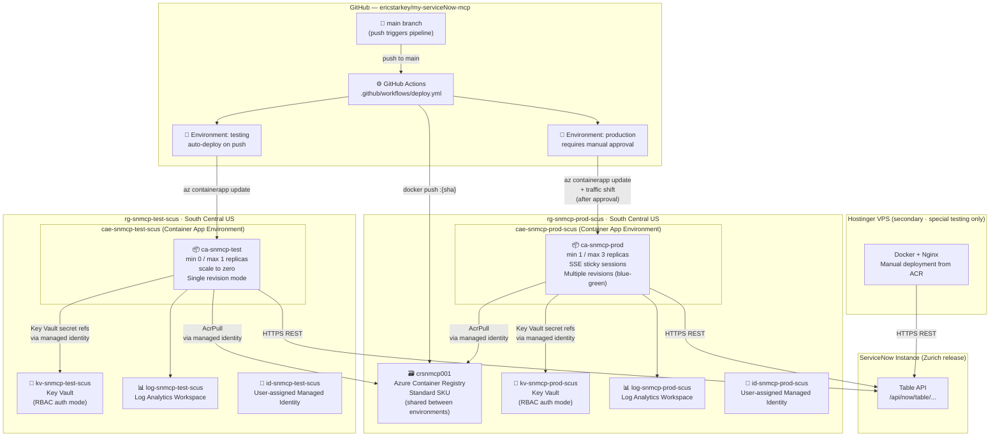

# Architecture — ServiceNow MCP Server

## Overview

The ServiceNow MCP server is a TypeScript MCP (Model Context Protocol) server that wraps the ServiceNow REST API and exposes ServiceNow capabilities as structured MCP tools and resources. It is deployed as a containerized HTTP+SSE service on Azure Container Apps.

---

## Azure Infrastructure Diagram



---

## CI/CD Pipeline Flow

```
Push to main
    │
    ▼
┌──────────────────┐
│  Job 1: test     │  npm typecheck · npm run lint · npm test
└────────┬─────────┘
         │ on pass
         ▼
┌──────────────────────────────────────────────────────────────────┐
│  Job 2: build                                                    │
│  • tag = first 7 chars of commit SHA                             │
│  • docker build -f docker/Dockerfile .                           │
│  • docker push crsnmcp001.azurecr.io/servicenow-mcp:{sha}       │
└────────┬─────────────────────────────────────────────────────────┘
         │
         ▼
┌──────────────────────────────────────────────────────────────────┐
│  Job 3: deploy-test  [environment: testing]                      │
│  • az containerapp update → ca-snmcp-test                        │
└────────┬─────────────────────────────────────────────────────────┘
         │
         ▼
┌──────────────────────────────────────────────────────────────────┐
│  Job 4: smoke-test                                               │
│  • GET /health on test ACA, retry up to 10× (handles cold-start) │
└────────┬─────────────────────────────────────────────────────────┘
         │ on pass
         ▼
┌──────────────────────────────────────────────────────────────────┐
│  ⏸ PAUSE — Manual approval required                              │
│  GitHub notifies: ericstarkey                                    │
│  Reviewer inspects test results, then approves or rejects        │
└────────┬─────────────────────────────────────────────────────────┘
         │ on approval
         ▼
┌──────────────────────────────────────────────────────────────────┐
│  Job 5: deploy-prod  [environment: production]                   │
│  • az containerapp update → ca-snmcp-prod (new revision)         │
│  • az containerapp ingress traffic set → 100% to new revision    │
│  • GET /health on prod ACA (verify)                              │
└──────────────────────────────────────────────────────────────────┘
```

---

## Component Responsibilities

| Path | Responsibility |
|------|---------------|
| [src/server/index.ts](../src/server/index.ts) | Entry point — reads env, selects transport, starts server |
| [src/server/mcpServer.ts](../src/server/mcpServer.ts) | Transport-agnostic MCP Server instance; registers all tools/resources |
| [src/server/httpTransport.ts](../src/server/httpTransport.ts) | Express + SSE transport; `/health`, `/sse`, `/messages` endpoints |
| [src/server/stdioTransport.ts](../src/server/stdioTransport.ts) | STDIO transport (local dev / Claude Desktop) |
| [src/tools/](../src/tools/) | MCP tool handlers: `create_ticket`, `get_ticket`, `list_ticket_types`, `get_ticket_schema` |
| [src/resources/](../src/resources/) | MCP resources: `servicenow://ticket-types`; static JSON field schemas |
| [src/servicenow/client.ts](../src/servicenow/client.ts) | Axios instance with auth injection and error normalization |
| [src/servicenow/tableApi.ts](../src/servicenow/tableApi.ts) | CRUD wrappers: `createRecord`, `getRecord`, `queryRecords` |
| [src/auth/authManager.ts](../src/auth/authManager.ts) | Auth strategy selector — returns correct headers per `AUTH_TYPE` |
| [src/auth/config.ts](../src/auth/config.ts) | Zod validation for all env vars at startup |
| [docker/Dockerfile](../docker/Dockerfile) | Multi-stage Alpine build: builder → production image |
| [.github/workflows/deploy.yml](../.github/workflows/deploy.yml) | CI/CD pipeline |
| [scripts/provision-azure.sh](../scripts/provision-azure.sh) | One-time idempotent Azure resource provisioning |

---

## Transport Mode

| `MCP_TRANSPORT` | Transport | Use case |
|-----------------|-----------|----------|
| `stdio` (default) | STDIO | Local dev, Claude Desktop |
| `http` | HTTP + SSE | ACA deployment, Codespaces, VPS |

Azure Container Apps always run with `MCP_TRANSPORT=http`.

---

## SSE Session Affinity

The HTTP transport tracks SSE sessions in process memory:

```
GET  /sse      → creates new SSEServerTransport, stores by sessionId
POST /messages → routes JSON-RPC body to correct transport by sessionId query param
```

Because session state is in-process, a POST to `/messages` must reach the **same replica** that established the SSE connection. Both ACAs have **sticky sessions (affinity: sticky)** enabled to guarantee this. A client is pinned to one replica for the lifetime of their SSE connection.

---

## Rollback

Prod uses `revisions-mode: multiple`. Each deployment creates an immutable revision tagged with the commit SHA. The previous revision stays at 0% traffic. To roll back:

```bash
# List available revisions
az containerapp revision list \
  --name ca-snmcp-prod \
  --resource-group rg-snmcp-prod-scus

# Shift all traffic to a previous revision
az containerapp ingress traffic set \
  --name ca-snmcp-prod \
  --resource-group rg-snmcp-prod-scus \
  --revision-weight ca-snmcp-prod--{previous-sha}=100
```

No pipeline run is required for rollback.

---

## Resource Naming Convention

All resources follow the Cloud Adoption Framework (CAF) naming pattern:

```
{resource-abbreviation}-{workload}-{environment}-{region}
```

| Abbreviation | Resource type |
|---|---|
| `rg` | Resource Group |
| `ca` | Container App |
| `cae` | Container App Environment |
| `cr` | Container Registry (no hyphens) |
| `kv` | Key Vault |
| `log` | Log Analytics Workspace |
| `id` | User-assigned Managed Identity |

Region abbreviation: `scus` = South Central US

---

## Mandatory Resource Tags

Every Azure resource carries these tags:

| Tag | Example value |
|-----|--------------|
| `application` | `servicenow-mcp` |
| `environment` | `prod` \| `test` |
| `region` | `southcentralus` |
| `tier` | `api` |
| `owner` | `ericstarkey` |
| `repository` | `https://github.com/ericstarkey/my-serviceNow-mcp` |
| `created-date` | `2026-03-25` |
